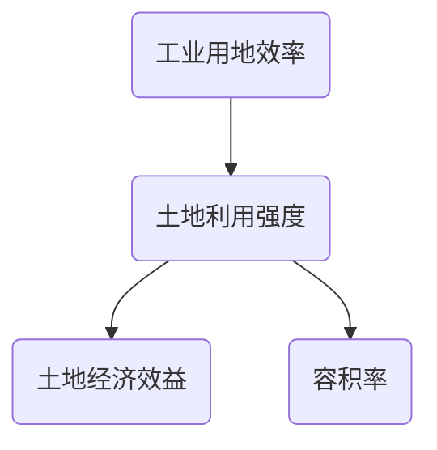

[TOC]


###### 标题标签

# 一级标题

## 二级标题

### 三级标题

#### 四级标题

##### 五级标题

###### 六级标题


###### 段落

段落的换行是使用两个以上空格加上回车  

###### 字体

*斜体字*
**粗体字**
_斜体字_

__粗体字__

***粗斜体字***

___粗斜体字___

###### 分割线

在一行中使用三个以上星号，减号，底线来建立一个分割，行内不能有其他东西。

------------

***

###### 删除线

~~删除线~~

###### 下划线

<u>下划线</u>

###### 脚注

脚注[^脚注]

[^脚注]:脚注

###### 列表

无序列表使用星号，加号或是减号，作为列表标记，这些列表标记后面要添加一个空格

* 第一项
* 第二项
* 第三项

+ 第一项
+ 第二项
+ 第三项

- 第一项
- 第二项
- 第三项

有序列表使用数字加点来表示

1. 第一项
2. 第二项
3. 第三项

列表嵌套    只需在子列表中的选项前面添加四个空格即可

1. 第一项:
      - 第一
      - 第二
      - 第三
2. 第二项：
       - 第一
           - 第二
           - 第三

###### 区块

> 区块

区块中使用列表

> 区块中的列表
>
> 1. 第一项
> 2. 第二项
>
> + 第一项
> + 第二项

区块中使用区块

> 区块
>
> > 区块中的区块
> >
> > > 区块中的区块中的区块

列表中使用区块

* 第一项

  > 区块

* 第二项

  > 区块

###### 代码

如果是段落上的一个函数或片段可以用单引号把他包起来。

`printf()`函数

代码区块，使用四个空格或者一个制表符（Tab键）。或者ctrl+shift+K。

```java
int i = 0;
while(true){
    i++;
}
```

也可以使用三个点 加上代码语言

```java
for(int i = 0 ; i < 100 ; i++){
    
}
```

###### 链接

[链接名称](链接地址)

[百度一下，你就知道](https://www.baidu.com/)

或者直接使用链接地址

<http://www.baidu.com>

高级链接

可以通过变量来设置一个链接，变量放置在文档末尾进行：

百度链接[百度][1]

1 https://www.baidu.com/ 

###### 图片

！[alt 属性文本](图片地址 图片标题可选)


Markdown还没有办法指定图片的高度与宽度，如果需要，可以使用标签


使用|来分隔不同的单元格，使用-来分隔表头和其他行。

|  表头  |  表头  |  表头  |  表头  |
| :----: | :----: | :----: | :----: |
| 单元格 | 单元格 | 单元格 | 单元格 |
|        |        |        |        |
|        |        |        |        |

###### 高级技巧

支持的HTML标签

<kbd> <b> <i> <em> <sup> <sub> <br>

<kbd>Ctrl</kbd>

转义

使用反斜杠显示特殊字符

**粗体**

\*\*正常显示符号\*\*  

公式
$$
f(x) = sin(x) +12
$$

$$
\sum_{n=1}^{100} n
$$

###### 脑图



